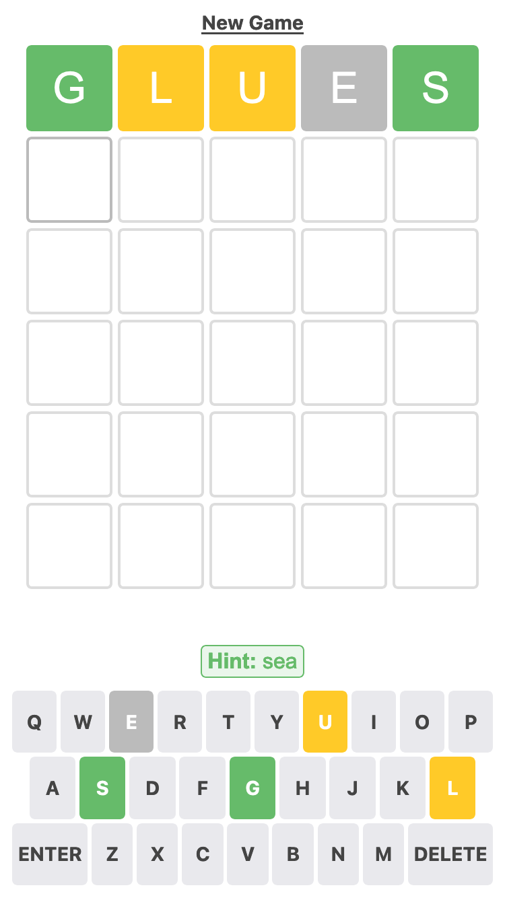

# Fivel

[Play now!](https://mrnyby.github.io/fivel/)

A create-your-own Wordle clone. Enter a word, generate a game link, and send it to your friends.

| Game Creation                                 | Light                                                 |   Dark                                              |
| --------------------------------------------- | ----------------------------------------------------- | --------------------------------------------------- |
|  |  |  |

## Features

### Sharing

Simply click or tap "Copy results" from the post-game dialog to copy game results to your clipboard. Delete a few rows of emojis to impress your peers!

```
Game ID: 42
2/6
🟩🟨🟨🟨⬜
🟩🟩🟩🟩🟩
```

### Game Saving

Game progress is saved every time you submit a guess. Refresh the page without losing your work, and worry not about accidentally replaying games you've already completed.

### Hints

Are you making a puzzle with a challenging word? Optionally provide a hint with the puzzles you create.

### Responsive Theme

Fivel automatically matches your operating system's light or dark theme. Bask in the sun, or hide in your cave; either way your eyes are safe.

## Contributing

Please report any problems on [GitHub](https://github.com/mrnyby/fivel/issues/new). For you nerd types, feel free to follow the instructions below and open a pull request.

### Setup

Install [NodeJS](https://nodejs.org/en), clone this repository, and run `npm install` in the root directory.

### Recommended IDE

[VS Code](https://code.visualstudio.com/) + [Svelte](https://marketplace.visualstudio.com/items?itemName=svelte.svelte-vscode).

### Scripts

This project uses several NPM scripts to manage various build tasks:

1. `build`: Compiles this project and outputs the result to the `docs` directory. GitHub Pages will host the code stored in this `docs` directory.
1. `check`: Provides diagnostics checks for unused CSS, accessibility hints, and JavaScript/TypeScript errors.
1. `dev`: Starts a local development server, compiles the project, and watches for changes to source files. Open browser tabs will be automatically refreshed when changes are made to source files.
1. `preview`: Starts a local server that hosts the code stored in the `docs` directory.
1. `test`: Runs unit tests.

### Technical considerations

**Why `global.d.ts` instead of `compilerOptions.types` inside `tsconfig.json`?**

Setting `compilerOptions.types` shuts out all other types not explicitly listed in the configuration. Using triple-slash references keeps the default TypeScript setting of accepting type information from the entire workspace, while also adding `svelte` and `vite/client` type information.

**Why enable `allowJs` in the TS template?**

While `allowJs: false` would indeed prevent the use of `.js` files in the project, it does not prevent the use of JavaScript syntax in `.svelte` files. In addition, it would force `checkJs: false`, bringing the worst of both worlds: not being able to guarantee the entire codebase is TypeScript, and also having worse typechecking for the existing JavaScript. In addition, there are valid use cases in which a mixed codebase may be relevant.

**Why is HMR not preserving my local component state?**

HMR state preservation comes with a number of gotchas! It has been disabled by default in both `svelte-hmr` and `@sveltejs/vite-plugin-svelte` due to its often surprising behavior. You can read the details [here](https://github.com/rixo/svelte-hmr#svelte-hmr).

If you have state that's important to retain within a component, consider creating an external store which would not be replaced by HMR.

```ts
// store.ts
// An extremely simple external store
import { writable } from "svelte/store"
export default writable(0)
```
